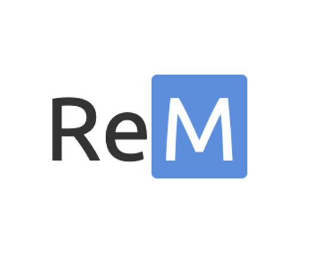
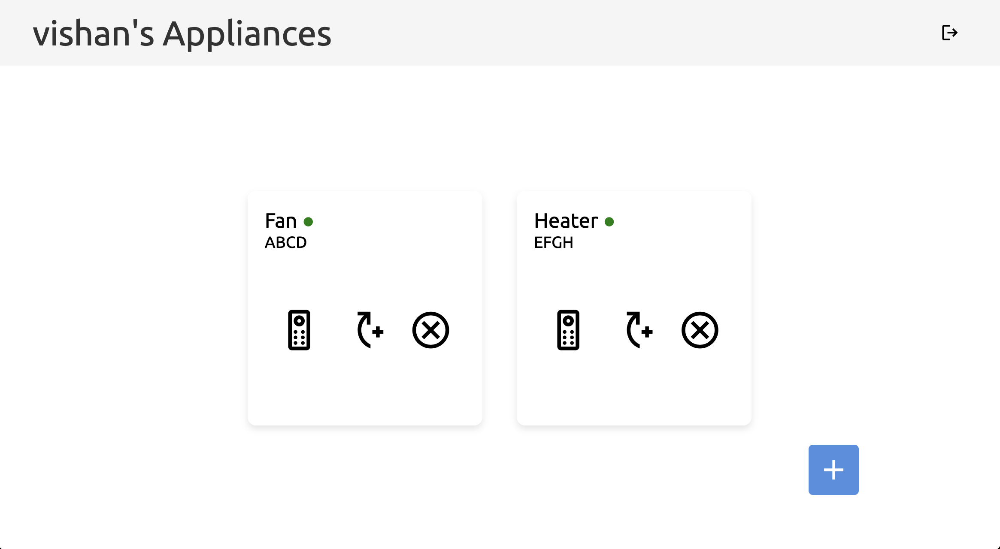

# ReM

Turn your ordinary IR appliances into smart devices and bring the power of convenience to your home with ReM!

## Transform Any IR Appliance into a Smart Device!

Imagine transforming your $15 fan into a smart device you can control with just your voice, effortlessly managing your air conditioner with a tap on your phone, or even turning on your heater automatically when it starts to snow! With ReM, powered by the versatile ESP32 microcontroller, all these possibilities are at your fingertips. 

### What Can You Do? 🚀

- **Remote Access**: Use the intuitive web interface to control your appliances from anywhere. Whether you're in the next room or miles away, your devices are always at your fingertips.
- **Button Mapping**: Easily remap your remote buttons, delete old mappings, or add new ones. Customize the control scheme that works best for you.
- **Real-Time Feedback**: Get instant feedback on your appliance status with the online/offline indicators. No more guessing – know if your appliance is connected at a glance!
- **API for Automation**: Exposes a simple API that you can use to integrate appliance control into your personal projects or home automation systems. Build your own custom solutions on top of the ReM platform!
- **Voice Control**: Integrate with your voice assistant and control your appliances hands-free. Just say the word, and let your devices do the work! (Note: This feature only works with Siri, using the Shortcuts app and the API)

### How It Works with ESP32 👾

The heart of ReM is the ESP32 microcontroller. This powerful and affordable device connects to your Wi-Fi network, communicates with the server, and sends IR signals to your appliances. The ESP32 is the bridge that transforms your ordinary appliances into smart devices!

All you need is an IR sender to transmit commands and an IR receiver to map the buttons from your existing remotes. With this setup, you can capture every function of your traditional remotes and bring them into the digital age, creating a seamless and intuitive smart home experience.

### Features

- **User Authentication and Management**: Secure your smart home experience with robust user authentication.
- **Appliance Management**: Add, list, delete, and control all your IR appliances through one central hub.
- **Button Mapping**: Customize your remote experience by mapping new buttons, remapping existing ones, or deleting unused mappings.
- **Real-Time Control**: The ESP32's fast response and the system's polling mechanism ensure your commands are executed in real-time.
- **HTTPS Support**: Keep your data secure with HTTPS. All communications are encrypted to protect your privacy.
- **API for Developers**: Access a flexible API to control your appliances programmatically. Perfect for integration into personal projects, scripts, or advanced automation setups.

### Screenshots 📸

Take a look at how sleek and user-friendly the dashboard is! Whether you're using a PC or a smartphone, control is always just a click away.

 

---

 

### Virtual Remote

Control your appliances with a virtual remote that mimics your traditional IR remote, but with all the added functionality of a smart device.

 

---

 

### Explore the Full Documentation 📚

For a detailed guide on how to set up, configure, and make the most of the IR Control System, including how to get started with the ESP32, please refer to the [full documentation](repo/documentation/ReM%20Technical%20Design%20Documentation.pdf). Here, you'll find everything you need to get started, including API reference, installation instructions, and more.

### Why Use ReM? 🤔

- **Affordable Smart Home Transformation**: Turn any IR-controlled appliance into a smart device without breaking the bank, using the cost-effective ESP32.
- **Versatile and Scalable**: Start with one device and scale up to control your entire home.
- **Developer-Friendly**: Use the API to create custom automations and integrations, expanding the functionality to fit your needs.
- **Secure**: With built-in authentication and HTTPS support, you can trust that your data is safe.

### Getting Started

Check out the Deployment section in the [documentation](repo/documentation/ReM%20Technical%20Design%20Documentation.pdf)!

---

## Note on Repository Contents ⚠️

This is the public version of the ReM's repository. It includes all the essential code and documentation needed to understand and use the system. Rest assured, this repository is fully functional, and all the code provided works as intended. You should be able to run the system smoothly using the provided instructions in the [documentation](repo/documentation/ReM%20Technical%20Design%20Documentation.pdf).

For security and privacy reasons, sensitive data, development configurations, and detailed commit history have been removed. This public repository was cloned from the private version and sanitized to exclude any sensitive information. The private repository, which contains the full commit history and sensitive details, is restricted to authorized personnel only.

If you need access to the complete repository that includes sensitive data, past commit history, and development configurations, please contact me. Access will be granted based on necessity and authorization.
